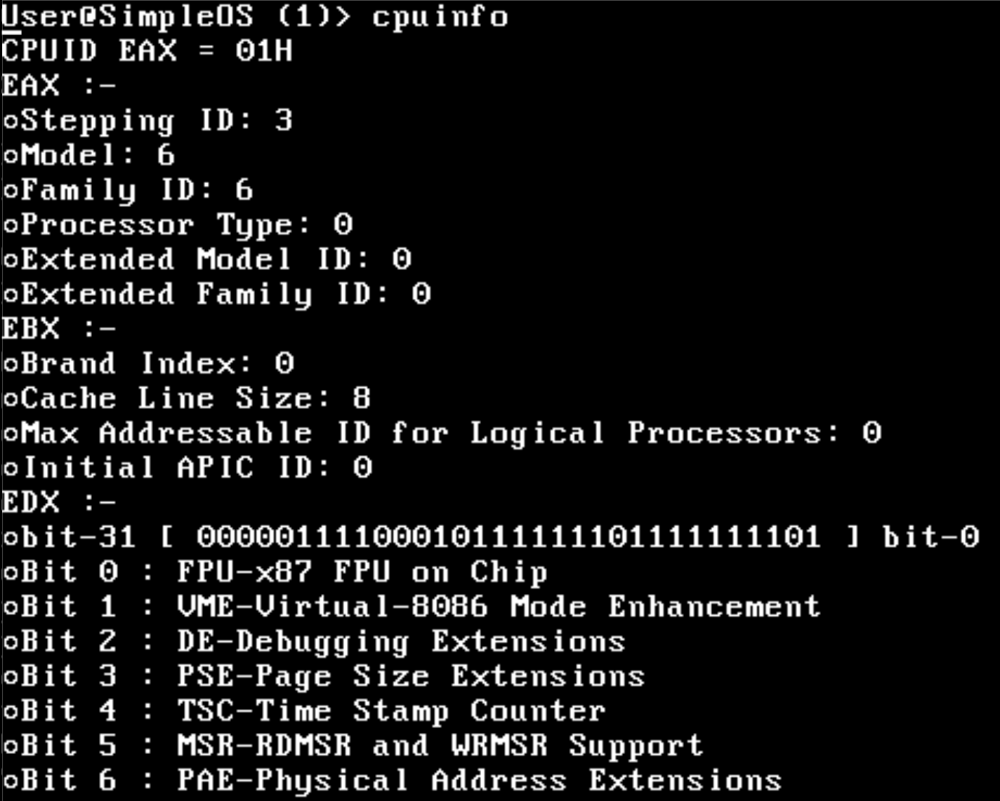
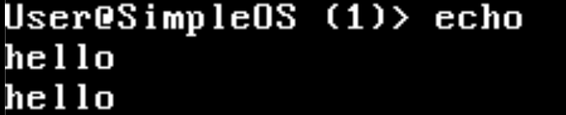
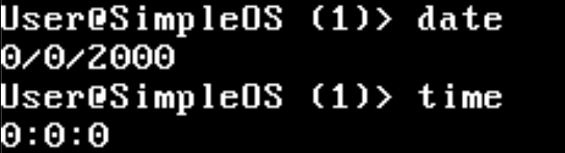
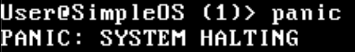

# How to use SimpleOS

## Booting
SimpleOS boots from Grub:

- To Boot SimpleOS, press enter.
- To reboot, navigate to reboot and press enter.

## Kernel
Next, you should be greeted by this screen:

## Shell Commands
Type `help` for supported shell commands:

