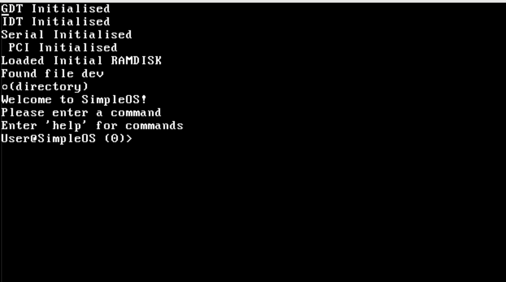

# How to use SimpleOS

## Booting
SimpleOS boots from Grub:

*To Boot SimpleOS, press enter.
*To reboot, navigate to reboot and press enter.

## Kernel
Next, you should be greeted by this screen:

## Shell Commands
### Help

Lists Avalible Commands

### cmd

